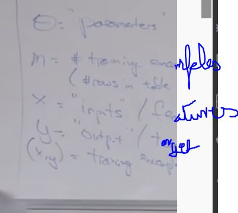
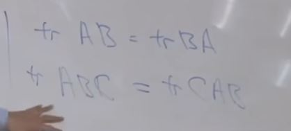

## Outline
1. Linear Regression
2. Batch/Stochastic Gradient
3. Normal Equation

## Process
1. Feed Training set to a learning algorithm
2. Generates a hypothesis which gives us the output

## How do you represent the hypoyhetis

xi , yi -> ith training example

-  Okay. So, um, and I think the final bit of notation, um, I've been writing h of x as a function of the features of the house, as a function of the size and number of bedrooms of the house. Um, sometimes we emphasize that h depends both on the parameters Theta and on the input features x. Um, we're going to use h_Theta of x to emphasize that the hypothesis depends both on the parameters and on the, you know, input features x

- This is J(theta)
- we add a 1/2 to make the calculation of derivative easier
- we minimize the difference
- Why square -> some reason for a generalisation because its kinda like a gaussian then.

## Gradient Descent 
- start with some theta (say theta is a vector of all zeros)
- keep changing theta to reduce J(theta)

- " a:= a+1" -> means assigning
- " a=b " -> asserting a = b
- alpha is learning rate

For only one example-

All term will be 0 in the partial derivative except thetaj

- alpha too large can overshoot the minima
- alpha too small too longer to train

Whole batch gradient descent is slow, As we read through entire data set then backprop so its super slow .

We use Stocastic gradient descent.

But SGD is noisy because we are updating in a batch but in average works fine.
So as you run stochastic gradient descent- stochastic gradient descent will actually, never quite converge. In- with- with batch gradient descent, it kind of went to the global minimum and stopped right, uh, with stochastic gradient descent even as you won't run it, the parameters will oscillate and won't ever quite converge because you're always running around looking at different houses and trying to do better than just that one house- and that one house- and that one house. Uh, but when you have a very large data-set, stochastic gradient descent, allows your implementation- allows you algorithm to make much faster progress. Uh, and so, um, uh, uh- and so when you have very large data-sets, stochastic gradient descent is used much more in practice than batch gradient descent. 

Traditionally the whole batch gradient descent is called batch gradient descent.

right, and this- this one I'm gonna present next is called the normal equation. It works only for linear regression, doesn't work for any of the other algorithms I talk about later this quarter. 

J, right. There's a function mapping from parameters to the real numbers. 

Ah and I got these four numbers by taking, um, the definition of F and taking the derivative with respect to A_1, 1 and plugging that here. Ah, taking the derivative with respect to A_1,2 and plugging that here and taking the derivative with respect to the remaining elements and plugging them here which- which was 0. 

## Deerivation of normal equation

the broad outline of what we're going to do is we're going to take J of Theta. Right. That's the cost function. Um, take the derivative with respect to Theta. Right. Ah, since Theta is a vector so you want to take the derivative with respect to Theta and you know well, how do you minimize a function? You take derivatives with [NOISE] respect to Theta and set it equal to 0. And then you solve for the value of Theta so that the derivative is 0. Right. The- the minimum, you know, the maximum and minimum of a function is where the derivative is equal to 0. So- so how you derive the normal equation is take this vector. Ah, so J of Theta maps from a vector to a real number. So we'll, take the derivatives respect to Theta set it to 0,0 and solve for Theta and then we end up with a formula for Theta that lets you just, um, ah, you know, immediately go to the global minimum of the- of the cost function J of Theta. 

Normal Equation

what if X is non-invertible? Uh, what that usually means is you have have redundant features, uh, that your features are linearly dependent. Uh, but if you use something called the pseudo inverse, you kind of get the right answer if that's the case. Although I think the, uh, even more right answer is if you have linearly dependent features, probably means you have the same feature repeated twice, and I will usually go and figure out what features are actually repeated, leading to this problem. 