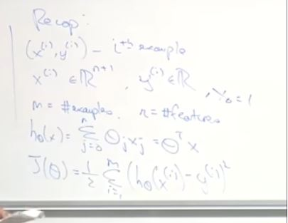

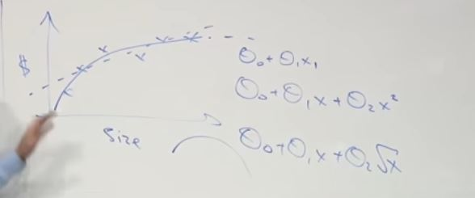

## Locally weighted regression

Automatically learns features

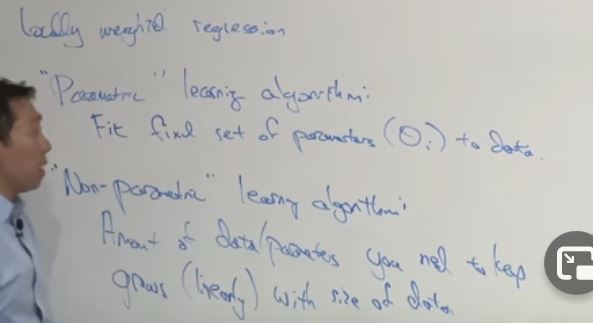

In leacture 2 we learned parametric learning algot=rithm because the parameters were fixed

Locally weighted regression is the "Non parametric" learning algorithm.

Linear Regression

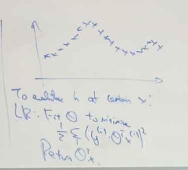

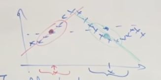

In Locally weighted regression Which is if this is the value of x and you want to make a prediction around that value of x. What you do is you look in a lo- local neighborhood at the training examples close to that point x where you want to make a prediction. And then, um, I'll describe this informally for now but we'll- we'll formalize this in math for the second. Um, but focusing mainly on these examples and, you know, looking a little bit at further all the examples. But really focusing mainly on these examples, you try to fit a straight line like that, focusing on the training examples that are close to where you want to make a prediction. And by close I mean the values are similar, uh, on the x axis. The x values are similar. And then to actually make a prediction, you will, uh, use this green line that you just fit to make a prediction at that value of x, okay? Now if you want to make a prediction at a different point. Um, let's say that, you know, the user now says, "Hey, make a prediction for this point." Then what you would do is you focus on this local area, kinda look at those points. Um, and when I say focus say, you know, put most of the weights on these points but you kinda take a glance at the points further away, but mostly the attention is on these for the straight line to that, and then you use that straight line to make a prediction, okay. Um, and so to formalize this in locally weighted regression, um, you will fit Theta to minimize a modified cost function.

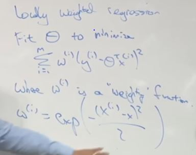

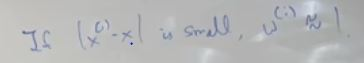

If xi - x is small, then the weight will be close to 1. Because, uh, if xi x- so x is the location where you want to make a prediction and xi is the input x for your ith training example. So wi is a weighting function, um, that's a value between 0 and 1 that tells you how much should you pay attention to the values of xi, yi when fitting say this green line or that red line. And so if xi - x is small so that's a training example that is close to where you want to make the prediction for x. Then this is about e to the 0, right, e to the -0 if the- if the numerator here is small and e to the 0 is close to 1. Right, um, and conversely if xi - x is large, then wi is close to 0. 

So when we are fitting the green line the red region points should get a weight of nearly 0.

And so the net effect of this is that this is summing if, if, you know, the terms multiplied by 0 disappear, right? So the net effect of this is that the sums over essentially only the terms, uh, for the squared error for the examples that are close to the value, close to the value of x where you want to make a prediction, 

Shape of the weight function

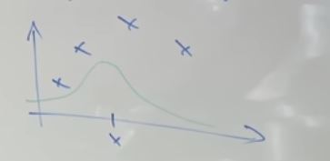

Um, and this is the shape of a Gaussian bell curve. But this has nothing to do with a Gaussian density, right, so this thing does not integrate to 1. So- so it's just sometimes you ask well, is this- is this using a Gaussian density? The answer is no. Uh, this is just a function that, um, is shaped a lot like a Gaussian but, you know, Gaussian densities, probability density functions have to integrate to 1 and this does not. So there's nothing to do with a Gaussian probability density. 
 
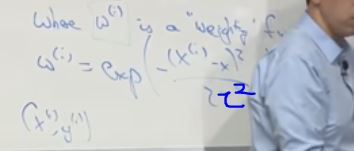

how do you choose the width of this Gaussian density, right? How fat it is or how thin should it be? Um, and this decides how big a neighborhood should you look in order to decide what's the neighborhood of points you should use to fit this, you know, local straight line. And so, um, for Gaussian function like this, uh, this- I'm gonna call this the, um, bandwidth parameter tau, right? And this is a parameter or a hyper-parameter of the algorithm. And, uh, depending on the choice of tau, um, uh, you can choose a fatter or a thinner bell-shaped curve, which causes you to look in a bigger or a narrower window in order to decide, um, you know, how many nearby examples to use in order to fit the straight line, okay? 

if tau is too broad, you end up fitting, um, you end up over-smoothing the data and if tau is too thin you end up fitting a very jagged fit to the data. 

I tend to use, uh, a locally weighted linear regression when, uh, you have a relatively low dimensional data set. 

So when the number of features is not too big, right? So when n is quite small like 2 or 3 or something and we have a lot of data. And you don't wanna think about what features to use, right. 

## Probalistic Interpretation

Why use the squared error not some quadratic or linear.

Why least squares?

Okay. So let's assume that the way, you know, housing prices truly work is that every house's price is a linear function of the size of the house and number of bedrooms, plus an error term that captures unmodeled effects such as maybe one day that seller is in an unusually good mood or an unusually bad mood and so that makes the price go higher or lower. We just don't model that, um, as well as random noise, right. Or, or maybe the model will skew this street, you know, preset to persistent capture, that's one of the features, but other things have an impact on housing prices. 

we're going to assume that, uh, epsilon i is distributed Gaussian would mean 0 and co-variance sigma squared. 

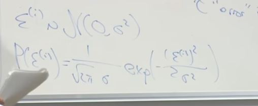

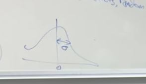

the huge assumption we're gonna make is that the epsilon I's these error terms are IID. And IID rom statistics stands for Independently and Identically Distributed. And what that means is that the error term for one house is independent, uh, as the error term for a different house. 
Which is actually not a true assumption. Right. Because, you know, if, if one house is priced on one street is unusually high, probably a price on a different house on the same street will also be unusually high. And so- but, uh, this assumption that these epsilon I's are IID since they're independently and identically distributed. Um, is one of those assumptions that, that, you know, is probably not absolutely true, but may be good enough that if you make this assumption, you get a pretty good model. 

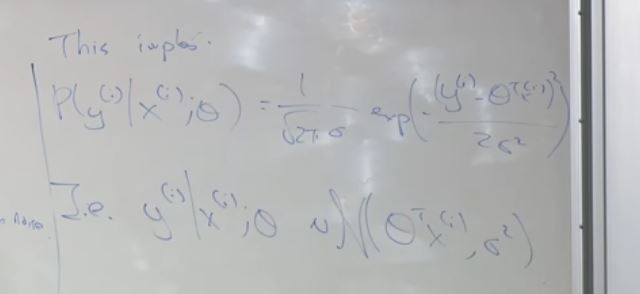

In other words, given x and theta, what's the density- what's the probability of a particular house's price? Well, it's going to be Gaussian with mean given by theta transpose xi or theta transpose x,
and the variance is, um, given by sigma squared. 

the probability of yi given xi and parameterize, oh, excuse me, parameterized by theta is equal to that formula,

We are not conditioning in theta.

under the assumptions we just made the likelihood of the parameters theta which is defined as the probability of all values- 

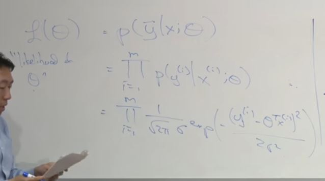

because we assumed the examples were- because we assume the errors are IID, right, that the error terms are independently and identically distributed to each other, so the probability of all of the observations, of all the values of y in your training set is equal to the product of the probabilities, because of the independence assumption we made. 

what's the difference between likelihood and probability, right? And so the likelihood of the parameters is exactly the same thing as the probability of the data, uh, but the reason we sometimes talk about likelihood, and sometimes talk of probability is, um, we think of likelihood. 

This thing is a function of the data as well as a function of the parameters theta. And if you view this number, whatever this number is, if you view this thing as a function of the parameters holding the data fixed, then we call that the likelihood. So if you think of the training set the data as a fixed thing, and then varying parameters theta, then I'm going to use the term likelihood. Whereas if you view the parameters theta as fixed and maybe varying the data, I'm gonna say probability,

why is epsilon i Gaussian? So, uh, uh, turns out because of central limit theorem, uh, from statistics, uh, most error distributions are Gaussian, right? If something is- if there's an era that's made up of lots of little noise sources which are not too correlated, then by central limit theorem it will be Gaussian. So if you think that, most perturbations are, the mood of the seller, what's the school district, you know, what's the weather like, or access to transportation, and all of these sources are not too correlated, and you add them up then the distribution will be Gaussian. 

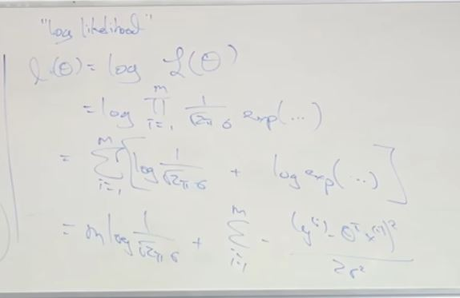

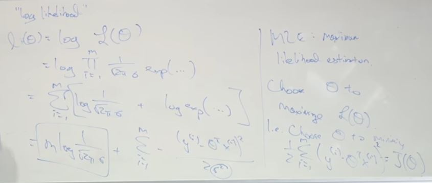

in other words, choose a value of theta so that that value of theta maximizes the probability of the data, right? And so, um, for- to simplify the algebra rather than maximizing the likelihood capital L is actually easier to maximize the log likelihood. But the log is a strictly monotonically increasing function. So the value of theta that maximizes the log likelihood should be the same as the value of theta that maximizes the likelihood. And if you divide the log likelihood, um, we conclude that if you're using maximum likelihood estimation, what you'd like to do is choose a value of theta that maximizes this thing, right? But, uh, this first term is just a constant, theta doesn't even appear in this first term. And so what you'd like to do is choose the value of theta that maximizes this second term. Ah, notice there's a minus sign there. And so what you'd like to do is, 

if you're willing to assume that the error terms are Gaussian and IID and if you want to use Maximum Likelihood Estimation which is a very natural procedure in statistics, then, you know, then you should use least squares.

## Logistic regression -> Value of y either 0 or 1

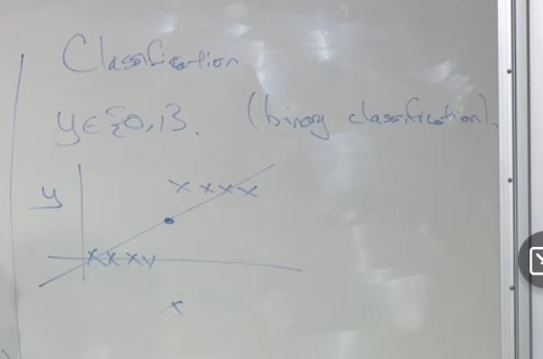

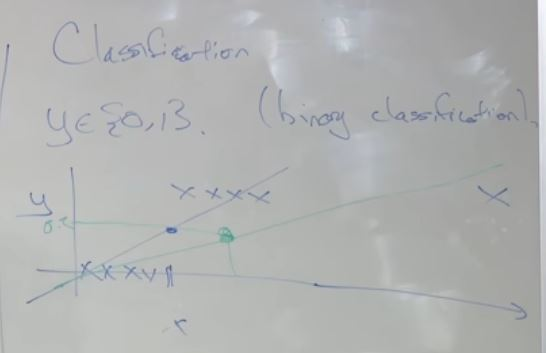

Linear regression is not good for classification problem , look in the image above if we have a point like the x in far right then we get the green line which is not good.

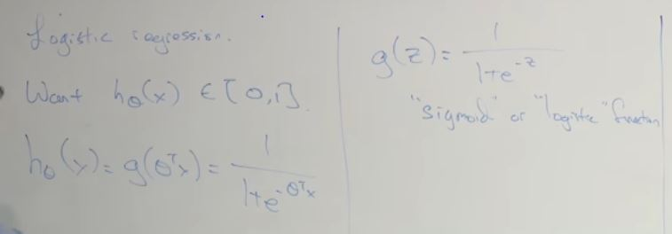

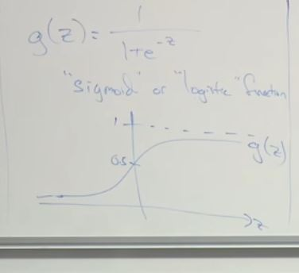

Sigmoid forces the values between 0 and 1

when designing a learning algorithm, uh, sometimes you just have to choose the form of the hypothesis. How are you gonna represent the function h, or h of- h subscript theta. 

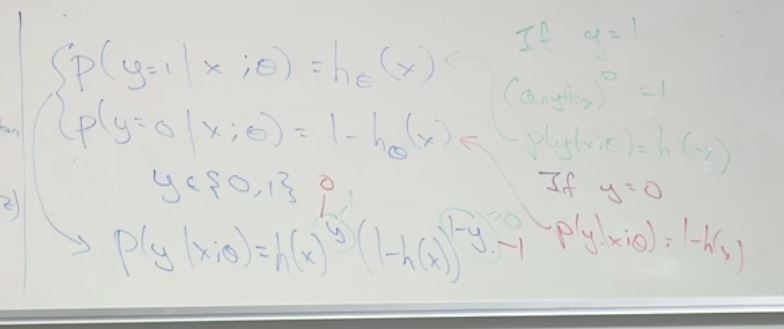

Test for y=1 and y=0

Will use maximum likelihood

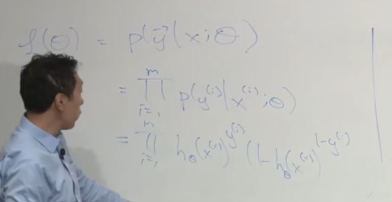

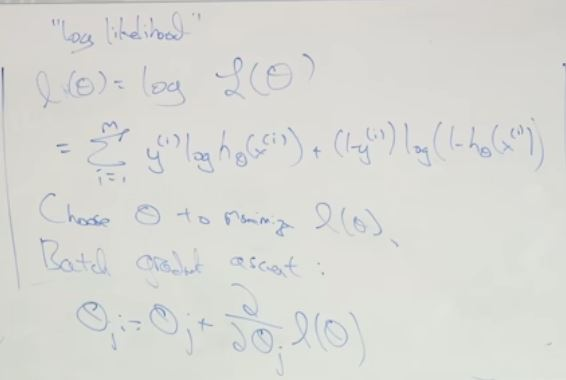

So the two differences between that is well, first instead of J of theta you're now trying to optimize the log-likelihood instead of this squared cost function. And the second change is, previously you were trying to minimize the squared error. That's why we had the minus. And today you're trying to maximize the log-likelihood which is why there's a plus sign. 

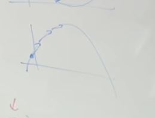

Gradient ascent is a concave function.

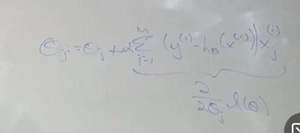

There is no local maxima

There's actually another reason why we chose the logistic function because if you choose a logistic function rather than some other function that will give you 0 to 1, you're guaranteed that the likelihood function has only one global maximum. 

the definition of H of theta is now different than before with linear regression but the surface level of the equation turns out to be the same. 

There is no known way to just have a close form equation unless you find the best value of theta which is why you always have to use an algorithm, an iterative optimization algorithm such as gradient ascent or ah and we'll see in a second Newton's method. 

## Newton's method

Um, you know, gradient ascent right is a good algorithm. I use gradient ascent all the time but it takes a baby step, takes a baby step, take a baby step, it takes a lot of iterations for gradient assent to converge. Um, there's another algorithm called Newton's method which allows you to take much bigger jumps so that's theta, you know, so- so, uh, there are problems where you might need you know,say 100 iterations or 1000 iterations of gradient ascent. That if you run this algorithm called Newton's method you might need only 10 iterations to get a very good value of theta. But each iteration will be more expensive. 

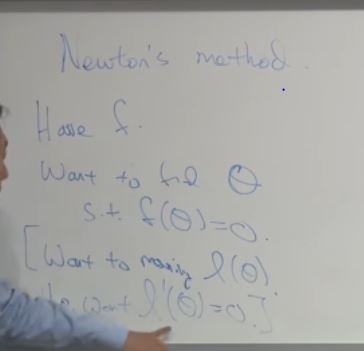

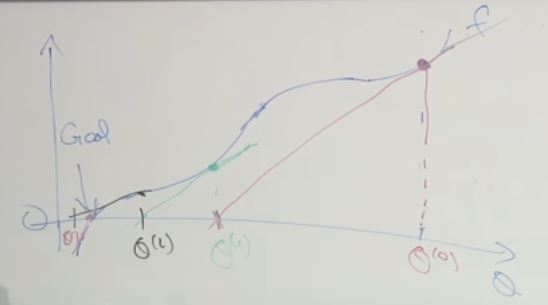

This is how one iteration of Newton's method will work, which is- let me use a different color. Right. Start off with theta 0, that's just a first value consideration. What we're going to do is look at the function f, and then find a line that is just tangent to f. So take the derivative of f and find a line that is just tangent to f. So take that red line. It just touches the function f. And we're gonna use, if you will, use a straight line approximation to f, and solve for where f touches the horizontal axis. So we're gonna solve for the point where this straight line touches the horizontal axis. Okay? And then we're going to set this, and that's one iteration of Newton's method. So we're gonna move from this value to this value, right? And then in the second iteration of Newton's method, we're gonna look at this point. And again, you know, take a line that is just tangent to it, and then solve for where this touches the horizontal axis, and then that's after two iterations of Newton's method. Right. And then you repeat. Take this, sometimes you can overshoot a little bit, but that's okay. Right? And then that's, um, there's a cycle back to red. Let's take the three, then you take this, let's take the four. 

Solve for delta

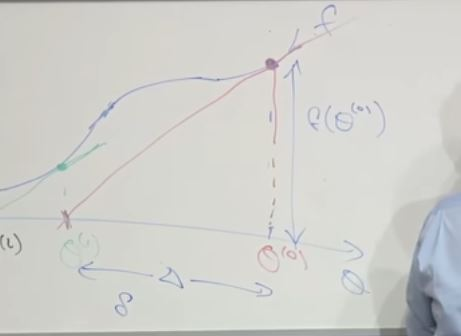

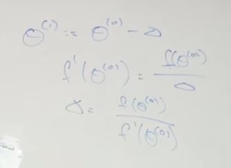

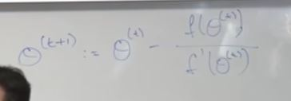

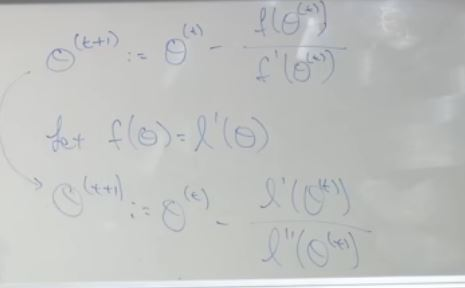

Newton's method enjoys a property called quadratic convergence. Not a great name. Don't worry- don't worry too much about what it means. But informally, what it means is that, um, if on one iteration Newton's method has 0.01 error, so on the X axis, you're 0.01 away from the, from the value, from the true minimum, or the true value of f is equal to 0. Um, after one iteration, the error could go to 0.0001 error, and after two iterations it goes 0.00000001. But roughly Newton's method, um, under certain assumptions, uh, uh, that functions move not too far from quadratic, the number of significant digits that you have converged, the minimum doubles on a single iteration. So this is called quadratic convergence. Um, and so when you get near the minimum, Newton's method converges extremely rapidly. Right? So, so after a single iteration, it becomes much more accurate, after another iteration it becomes way, way, way more accurate, which is why Newton's method requires relatively few iterations. 

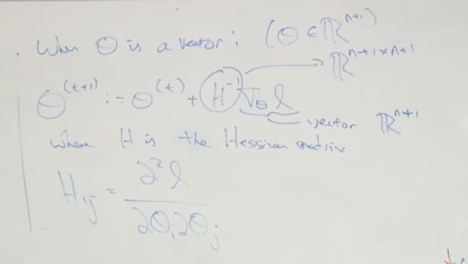

the disadvantage of Newton's method is that in high-dimensional problems, if theta is a vector, then each step of Newton's method is much more expensive, because, um, you're, you're either solving a linear system equations, or having to invert a pretty big matrix. So if theta is ten-dimensional, you know, this involves inverting a 10 by 10 matrix, which is fine. But if theta was 10,000 or 100,000, then each iteration requires computing like a 100,000 by a 100,000 matrix and inverting that, which is very hard. Right? It's actually very difficult to do that in very high-dimensional problems. 

for- if the number of parameters in your iteration is not too big, if you have 10 parameters, or 50 parameters, I would almost certainly- I would very likely use Newton's method, uh, because then you probably get convergence in maybe 10 iterations, or, you know, 15 iterations, or even less than 10 iterations. But if you have a very large number of parameters, if you have, you know, 10,000 parameters, then rather than dealing with a 10,000 by 10,000 matrix, or even bigger, the 50 by 1000 by 50,000 matrix, and you have 50,000 parameters, I will use, uh, gradient descent then. Okay? But if the number of parameters is not too big, so that the computational cost per iteration is manageable, then Newton's method converges in a very small number of iterations, and, and could be much faster algorithm than gradient descent. 