## Percepton

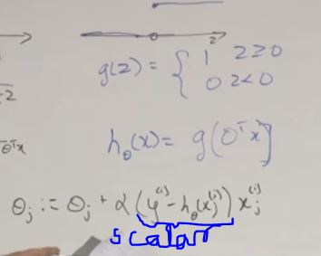

- The scalar part will be either 
- 0 -> if correct is predicted
- 1 -> if wrongly predicted

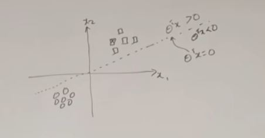

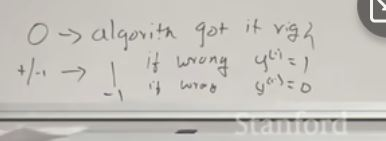

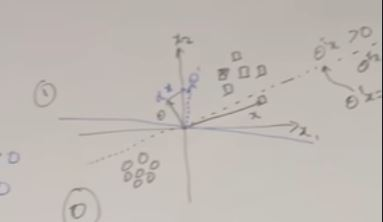

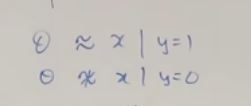

So, um, this essentially means that as Theta is rotating, the, um, decision boundary is kind of perpendicular to Theta. And you wanna get all the positive x's on one side of the decision boundary. And what's the- what's the, uh, most naive way of- of- of taking Theta and given x, try to make Theta more kind of closer to x? A simple thing is to just add a component of x in that direction. You know, add it here and kind of make Theta. And so this- this is a very common technique used in lots of algorithms where if you add a vector to another vector, you make the second one kind of closer to the first one, essentially

Um, you go example by example in an online manner, and if the al- if the, um, example is already classified, you do nothing. You get a 0 over here. If it is misclassified, you either add the- add a small component of, uh, as, uh, you add the vector itself, the example itself to your Theta or you subtract it, depending on the class of the vector. 

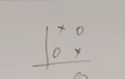

Um, it's, um, not used in practice because, um, it- it does not have a probabilistic interpretation of what's- what's happening. You kinda have a geometrical feel of what's happening with- with the hyperplane but it- it doesn't have a probabilistic interpretation. Also, um, it's, um, it- it was- and I think the perceptron was, uh, pretty famous in, I think, the 1950s or the '60s where people thought this is a good model of how the brain works. And, uh, I think it was, uh, Marvin Minsky who wrote a paper saying, you know, the perceptron is- is kind of limited because it- it could never classify, uh, points like this. 

## Exponential Families

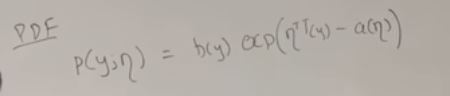

y is the data

And the reason- there's a reason why we call it y and not x. And that- and that's because we're gonna use exponential families to model the output of your- of- of your data, you know, in a, uh, in a supervised learning setting. 

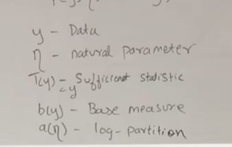

the reason why this is called the log-partition function is pretty easy to see because this can be written as b of y, ex of Eta, times t of y over. So these two are exactly the same. 

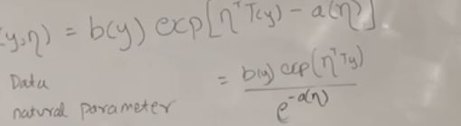

So, uh, this is, um, you can think of this as a normalizing constant of the distribution such that the, um, the whole thing integrates to 1, right? Um, and, uh, therefore the log of this will be a of Eta, that's why it's just called the log of the partition function. 

So the partition function is a technical term to indicate the normalizing constant of, uh, probability distributions. 

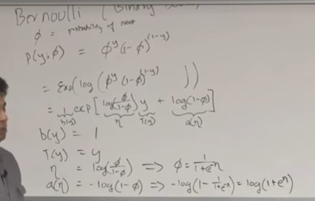

Our goal is to take bernouli and exponential family and find a b and whatnot

So this, this kind of, uh, verifies that the Bernoulli distribution is a member of the exponential family. 

This kinda looks like the sigmoid function.

### Gaussian with fixed variance

NLL -> negative log likelihood

E -> expectation is mean

Var -> Variance

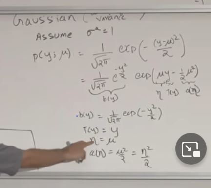

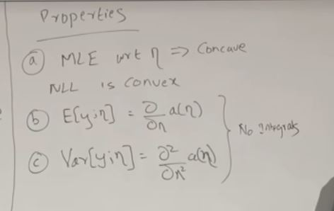

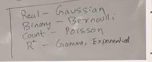

## Generalised Linear Model(GLM's)

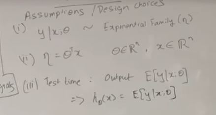

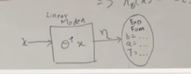

So you're not learning any the parameters in the, uh, in the, uh, uh, exponential family. We're not learning Mu or Sigma square or, or Eta. We are not learning those. We're learning Theta that's part of the model, and not part of, uh, the distribution. And the output of this will become the, um, the distributions parameter. 

Learning update rule is the same.

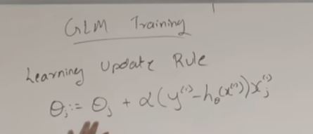

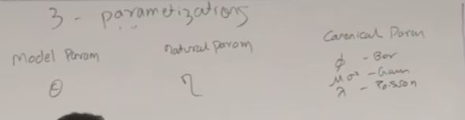

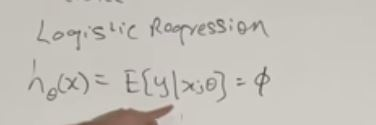

Because in logistic the choice is bernoulli.

Maybe you speak a little bit more about choosing a distribution to be the output. Yeah. So the, uh, the choice of what distribution you are going to choose is really dependent on the task that you have. So if your task is regression, where you want to output real valued numbers like, you know, price of the house, or- or something, uh, then you choose a distribution over the real va- real- real numbers like a Gaussian. If your task is classification, where your output is binary 0, or 1, you choose a distribution that models binary data. Right? So the task in a way influences you to pick the distribution. And, you know, uh, most of the times that choice is pretty obvious. [NOISE] If you want to model the number of visitors to a website which is like a count, you know, you want to use a Poisson distribution, because Poisson distribution is a distribution over integers. So the task deci-, you know, pretty much tells you what distribution you want to choose, and then you- you do the- you know, uh, um, you do this, you know, all- you- you go through this machinery of- of- of figuring out what are the, uh, what h state of X is, and you plug in h state of X over there and you have your learning rule. 

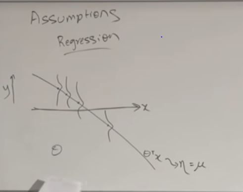

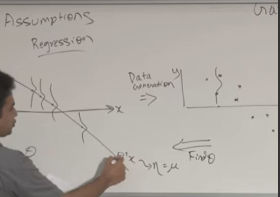

## Softmax Regression

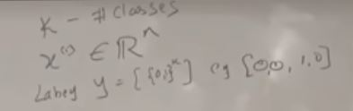

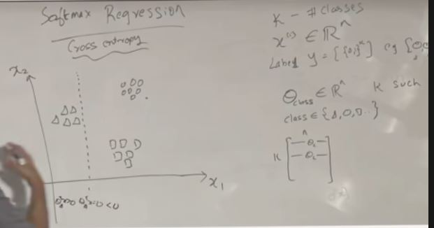

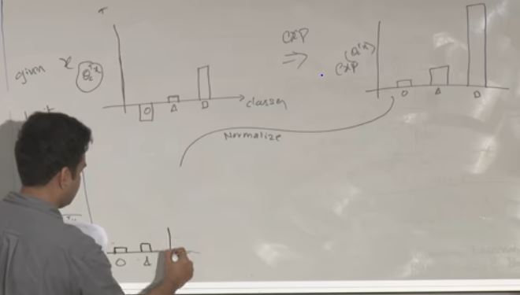

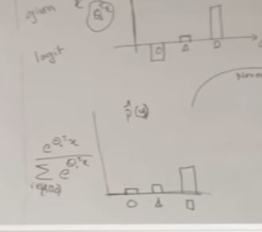

See lecture Notes.