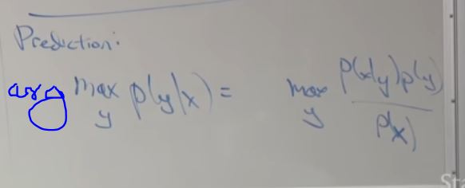

than looking at both classes simultaneously and searching for a way to separate them, a generative learning algorithm, uh, instead builds a model of what each of the classes looks like, kind of almost in isolation, with some details we'll learn about later. And then at test time uh, it evaluates a new example against the benign model, evaluates against the malignant model and tries to see which of the two models it matches more closely against. 

kinda like clustering

## Gaussian Discriminant Analysis

### Multivariate Gaussian Distribution

#### Reducing Covariance

#### Increasing Covariance

Varrying the mean we can shift the center of the gaussian distribution.

##

So the big difference between the- these two cost functions, is that for logistic regression or linear regression and generalized linear models, you were trying to choose parameters theta, that maximize p of y given x. But for generative learning algorithms, we're gonna try to choose parameters that maximize p of x and y or p of x, y, right. 

Um, so you choose the parameters phi, mu0, mu1, and sigma they maximize the log likelihood, right. Where this you define as, you know, log of the likelihood that we defined up there. Um, and so, uh, th- we, we actually ask you to do this as a problem set in the next homework. But so the way you maximize this is, um, look at that formula for the likelihood, take logs, take derivatives of this thing, set the derivative equal to 0 and then solve for the values of the parameters that maximize this whole thing. 

So the min is the smallest possible value attained by the thing inside and the arg min is the value you need to plug in to achieve that smallest possible value.

Fit 2 gaussian to the data points.

So why- why- why do we use two separate means, mu 0 and mu 1 and a single covariance matrix sigma? It turns out that, um-. It turns out that if you choose to build the model this way, the decision boundary ends up being linear and so for a lot of problems if you want to linear decision boundary, um, uh, um, yeah. And it turns out you could choose to use two separate, um, covariance matrix sigma 0 and sigma 1, and they'll actually work okay. Right. There's- it is actually very reasonable to do so as well, but you double the number of parameters roughly and you end up with a decision boundary that isn't linear anymore. But it is actually not an unreasonable algorithm to do that as well. 

Variance is same

## When GDA is superior and when discriminative algorithms are superior?

the generative learning algorithm in this case, this makes a stronger set of assumptions and which this regression makes a weaker set of assumptions because you can prove discriminative assumptions from GDA assumptions. 

Excuse me, of the exponential family distribution.
54:06
Right. And so what this means is that, um,
54:11
if you don't know if your data is Gaussian or Poisson,
54:14
um, if you're using logistic regression you don't need to worry about it.
54:18
It'll work fine either way.
54:20
Right. So- so, you know, maybe, um,
54:22
you are fitting data to s- maybe a fitting, uh,
54:25
uh, a model, binary classification model to some data.
54:28
And you don't know, is a data Gaussian?
54:30
Is it Poisson? Is this some other exponential family model? Maybe you just don't know.
54:34
But if you're fitting logistic regression,
54:36
it- it'll do fine under all of those scenarios.
54:39
Right. But if your data was actually Poisson but you assumed it was Gaussian,
54:44
then your model might do quite poorly. 

if you make weaker assumptions as in logistic regression,
55:00
then your algorithm will be more robust to modeling
55:03
assumptions such as accidentally assuming the data is Gaussian and it is not.
55:06
Uh, but on the flip side,
55:08
if you have a very small dataset, then, um,
55:11
using a model that makes more assumptions will actually allow you to do better
55:16
because by making more assumptions you're just
55:18
telling the algorithm more truth about the world which is,
55:21
you know, "Hey, algorithm, the world is Gaussian," and if it is Gaussian,
55:24
then it will actually do- do- do better. 

 and so for a lot of problems we have a lot of data,
56:26
I would probably use logistic regression.
56:29
Because with more data,
56:31
you could overcome telling the algorithm less about the world.
56:34
Right. So- so the algorithm has two sources of knowledge.
56:37
Uh, one source of knowledge is what did you tell it,
56:40
what are the assumptions you told it to make?
56:42
And the second source of knowledge is learned from
56:44
the data and in this era of big data,
56:47
we have a lot of data, you know,
56:49
there is a strong trend to use logistic regression which makes
56:52
less assumptions and just lets the algorithm
56:53
figure out whether it wants to figure out from the data.
56:56
Right. Now, one practical reason why I still use algorithms like the GDA,
57:01
general discriminant analysis, so algorithms like this,
57:03
um, uh, is that,
57:05
it's actually quite computationally efficient and so
57:07
the- there's actually one use case at Landing. AI that we're working
57:10
on where we just need to fit a ton of models and
57:12
don't have the patience to run the GC progression over and over.
57:15
And it turns out computing mean and variances of, um,
57:19
covariance matrices is very efficient and so
57:22
there's actually apart from the assumptions type of benefit,
57:25
uh, which is a general philosophical point.
57:27
We'll see again later in this course.
57:29
Right. Th- this idea about do you make strong or weak assumptions?
57:32
This is a general principle in machine learning that we'll see again in other places.
57:35
But the very concrete- the other reason I tend to use GDA these days is
57:39
less that I think I perform better from
57:41
an accuracy point of view but there's actually a very efficient algorithm.
57:44
We just compute the mean covar- covariance and we are
57:46
done and there's no iterative process needed.
57:48
So these days when I use these models, um,
57:51
is more motivated by computation and less by performance.
57:56
But this general principle is one that we'll come back to again later
57:59
when we develop more sophisticated learning algorithms

Oh, right, ah, so what happens when the co-variance matrices are different?
58:17
It turns out that, uh,
58:19
uh, trying to remember, it still ends up being a logistic function but with
58:21
a bunch of quadratic terms in the logistic function.
58:23
So it's not a linear decision boundary anymore.
58:25
You can end up with a decision boundary,
58:27
you know, that- that- that looks like this, right?
58:29
With positive and negative examples separated by
58:31
some- by some other shape from a linear decision boundary. 

if, uh,
62:12
x given y equals 1,
62:13
uh, it comes from an exponential family distribution,
62:16
x given y equals 0 comes to an exponential family distribution,
62:19
it's the same exponential family distribution and if they
62:21
vary only by the natural parameter of the exponential family distribution,
62:25
then this will be logistic. 

when you have less data the algorithm needs to rely more on assumptions you code in. 

GDA in the context of, um,
64:03
continuous valued, uh, features x. 

## Naive Bayes

