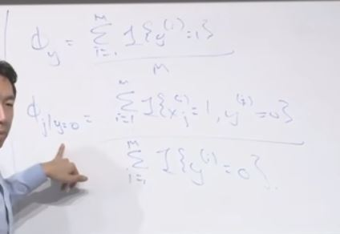
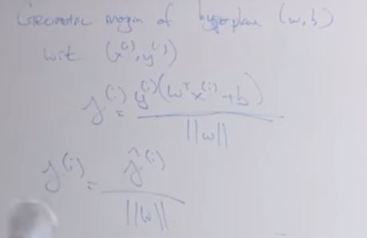

## Laplace Smoothing

Its a bad idea to estimate a probability as 0 just because we haven't seen that data in the dataset.

In maximum likelihood we give it 0.

Um, and so what Laplace smoothing, what we're going to do is, uh, imagine that we saw the positive outcomes, the number of wins, you know, just add 1 to the number of wins we actually saw and also the number of losses add 1. Right? So if you actually saw 0 wins, pretend you saw one and if you saw 4 losses, pretend you saw 1 more than you actually saw. And so Laplace smoothing, you're gonna end up adding 1 to the numerator and adding 2 to the denominator. And so this ends up being 1 over 6, right? And that's actually a more reasonable may- maybe it is a more reasonable estimate for the chance of, uh, them winning or losing the next game. 

Multivariate Bernuolli event model

That the, the model we've talked about so far is sometimes called the Multivariate Bernoulli. And that model, uh, so Bernoulli means coin tosses, so multivariate means, you know, there are 10,000 Bernoulli random variables in this model whereas as a Multivariate Bernoulli event model. An event comes with statistics I guess. 

Um, and the new representation we're gonna talk about is called the Multinomial Event Model. 

 

 

Oh, what do you do if the word's not in your dictionary? So, um, uh, there are two approaches to that. One is, um, just throw it away. Just ignore it, disregard it, that's one. Uh, second approach, is to take the rare words and map them to a special token which traditionally is denoted UNK for unknown words. So, um, if in your training set, uh, you decide to take just the top 10,000 words in- into your dictionary, then everything that's not in the top 10,000 words can map to your unknown word token or the unknown words special symbol.

when would you use the Naive Bayes algorithm. It turns out Naive Bayes algorithm is actually not very competitive with other learning algorithms. Uh, so for most problems you find that logistic regression,um, will work better in terms of delivering a higher accuracy than Naive Bayes. But the- the- the advantages of Naive Bayes is, uh, first it's computationally very efficient, and second it's relatively quick to implement, right? And it also doesn't require an iterative gradient descent thing, and the number of lines of code needed to implement Naive Bayes is relatively small. So if you are, uh, facing a problem, way you go is to implement something quick and dirty, then Naive Bayes is- is maybe a reasonable choice. 

## Support Vector Machine

 

 

 

 

 

 

 

